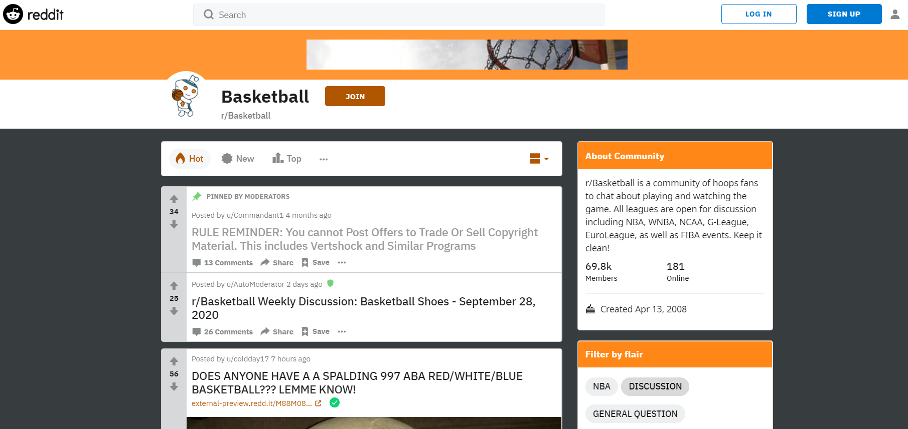
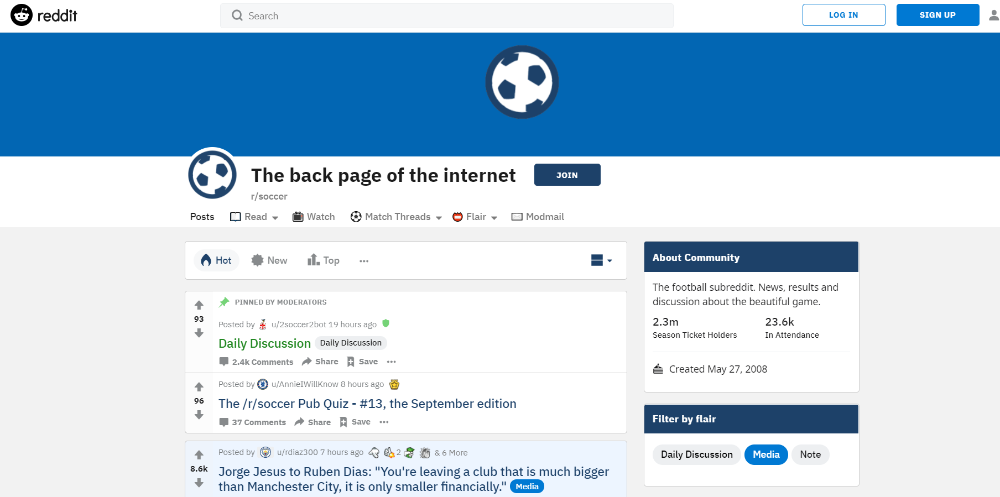

#  Project 3: Web APIs & Classification

### John Lim Jian Ann, DSI-17-Singapore

---

## Problem Statement

Major League Soccer (MLS) is working on a project to expand their competitive team count from 26 teams to 30 teams by 2023. The purpose of the project is to increase their viewership in the US as well as attract international soccer stars to join MLS teams. As of now, MLS wants to run an online marketing campaign through social media platforms and billboards in hope of making their expansion project known. To improve engagement with fans, MLS asked fans to send in their suggestions for the slogan. This marketing campaign requires a slogan that is clear, precise and not to be confused with other major sporting events in the US. However, due to the popularity of National Basketball Association (NBA), most suggested slogans are likely to be associated with basketball.

This slogan will be all over social media, participating team's stadiums and merchandise thus it is crucial that the slogan is related to soccer instead of the basketball. The goal of the project is to develop a classification model that can evaluate suggested slogans and tell whether the slogan is more associated to soccer or basketball.

## Executive Summary

The Beautiful Game is a nickname for football or soccer, popular within media and advertising, it was made popular by a South American who is a legend of the sport. From 1996, Major League Soccer (MLS) is the league that plays soccer at the highest level in US and Canada. Providing entertainment by playing the beautiful game, MLS has expansion plans to increase its competing team capacity from 26 to 30 by 2023. Although the beautiful game is ranked as the most popular sport worldwide, it is only the 4th ranked sport in terms of popularity in the US.

To maintain their competitive standards and with the aim of increasing viewership, MLS will be expanding the number of competitive teams from 26 to 30 teams by 2023. With that in the pipeline, MLS is focusing on marketing themselves to let fans and players know what the future holds for the league. MLS needs a slogan for this expansion project that will be the talk of the town among soccer fans. This slogan will be printed on participating team's stadiums and merchandise as well as on social media as part of marketing efforts. However, due to the popularity of the NBA in the US, suggested slogans seem to be associated to basketball.

My team and I have developed a model that is able to provide the solution to the problem. This model is able to tell whether a sentence is more associated to soccer or basketball and you could use this model to test on any suggested slogans. This can potentially solve the issue of deciding on a slogan that is thought to be associated to soccer but instead, more associated to basketball. The model is not just limited to testing suggested slogans but you can also test taglines, phrases that you might want to use for future marketing etc.

After cleaning and analysing top posts and comments by netizens in both soccer and basketball subreddits, we used the sentences collected to train various classification model. Our model selection is base on the specificity and accuracy. In essence, we want to make sure our model does not predict a sentence/text to be soccer when it is actually associated to basketball (where soccer is 1 and basketball is 0), we select the model that gives us a specificity (True Negative Rate) of as close to 1 as possible. As we have a rather balanced data set for both basketball and soccer, we used accuracy to evaluate our models. We select the model that gives us a higher accuracy in making predictions to make sure the model is accurate overall in its predictions.

We used both Count and Tfidf Vectorizers to process the text and fitted the text into Multinomial Naive Bayes Model, K Nearest Neighbors Model, Support Vector Machine Model as well as Logistic Regression Model. We then proceed to tune the hyperparameters of the vectorizers to achieve the optimal results. As mentioned, what we want is to have a high specificity and high accuracy, where we want to minimize the possibility of predicting a text/sentence as associated to soccer(predict) when it is actually associated to basketball(actual). After evaluating our results, we selected the Multinomial Naive Bayes Model with Tfidf Vectorizer as our production and implementation model as it gives us a the most optimal specificity and is highly accurate.

We believe the model we developed is capable of solving the issue of evaluating whether a suggested slogan is associated to basketball or soccer. By adopting our model, MLS will be able to filter out all the suggested slogans that are associated to basketball and show only soccer slogans. From there, it narrows down the options and saves time in your consideration. Besides the slogan, this model is not subjected to a one time usage. You can implement it for any future testing of sentences and texts in your marketing materials or campaigns.

---

## Data dictionary:

|Feature|Type|Description|Value|
|---|---|---|---|
|**title**|str|Title of post made by a subreddit member||
|**selftext**|str|Text of post made by a subreddit member||
|**comments**|str|Single comment made in a given post||
|**subreddit**|int|The subreddit that the text is associated to|0 for Basketball  1 for Soccer|
|**text**|str|Concatenation of title selftext and comments||

---

## Data Collection
 - Webscraped titles, selftexts, comments and subreddits from Reddit API. Analysed and adjusted the code such that the length of data is around the same for both basketball and soccer subreddits.

---
## Text Preprocessing and EDA

**Cleaning and removing duplicates**
 - Replaced null values with ''
 - Concatenate selftext and title into text column
 - Dropped all columns except title, selftext, comments, text and subreddit
 - Removed duplicates in text column

**Preprocessing Text Data**
 - Removed punctuations and stopwords, swearwords, emojis, CSS classes
 - Stemmed each words in the text and lower case all of them
 - Remove all words that has single alphabets

**Exploratory Data Analysis**
 - Generally balanced dataset between basketball and soccer
 - Displaying top and bottom words associated to basketball
 - Displaying top and bottom words associated to soccer
 - Outliers will be addressed by vectorizer's hyperparameter

---

## Model Execution and Selection

**Train / Test Split**
 - Splitted the Supervised data set to 80% - 20% where 80% is used for modelling and 20% is used for validation
 - From the 80% that we got in the first split, we resplit it to another 80% for training the model and 20% for supervised testing

**Benchmark model and baseline score**
 - K Nearest Neighbors Model as benchmark model
 - We have used the K Nearest Neighbors as our benchmark model. What we are trying to achieve here is to increase the specificity of the model to as close as 1 as possible. We will focus more on specificity as we want to minimize as many false positive as possible. We dont want to have a case where we predicted a sentence/text as soccer but in fact, it is actually basketball. As we have a balanced dataset, We also want to improve our accuracy of the model. Currently, our specificity is at 0.98571 and our accuracy is at 0.74680 to unseen data. We will proceed to tune our paramteres to get the best model we want.

**Hyperparameters Tuning**
 - Used GridSearchCV to tune the parameters of vectorizers and models

**Assessment**
 - Test models with specificity, accuracy and sensitivity

**Model selection**
 - We selected the Multinomial Naive Bayes with Tfidf Vectorizer as our production model due to the high specificity and accuracy. Remember that we want to optimize the specificity of our model as we want to filter out all texts that are associated to basketball. Having said that, we want a model that gives us minimum false positives as soccer is 1 while basketball is 0.
 - By implementing our model on unseen data, we yield the following results :

||Production Model|Benchmark Model|
|---|---|---|
|**Specificity**|0.92355|0.62385|
|**Accuracy**|0.8994|0.63281|
|**Sensitivity**|0.87801|0.86750|

**Final Model Details**
 * Multinomial Naive Bayes with Tfidf Vectorizer
 * Specificity  : 0.92355
 * Sensitivity	: 0.87801
 * Accuracy     : 0.8994
 * f1 score	: 0.90

---
## Limitations, Conclusion and Recommendations

**Limitations**

Our model is fitted with sentences that were scrapped from basketball and soccer reddit APIs. As such, the model analysis is limited to the corpus of texts obtained.

Any words that are new to the corpus will not be considered when doing vectorizing transformation and prediction. At the same time, the API has a maximum capacity. So the data that we obtained are limited by the this cap.

Our logistic model assumes linear separability between different texts. However, in reality, texts or comments are not exactly linearly separable. At the same time, Naive Bayes model assumes independence between features. Texts or comments may not be independent in fact

Our models are only applicable to analyse basketball and soccer sentences. If a sentence is related to other sports, for example american football, our model might predict the text being associated to soccer

We are trying to classify between soccer texts and basketball texts this is because of the nature of MLS business. If MLS wants to compare between other sports, all we have to do is to repeat the process by getting the data we want, retrain our model and we will be able to get the model we want.

**Conclusion and Recommendations**

Even with unseen data, our production model outperformed the benchmark model in specificity, accuracy as well as sensitivity. This shows that our model is able to tell whether a statement is associated to soccer or basketball and can help in evaluating any suggested slogans.

We included a few sample slogans above to show you how our model evaluates them. The first sample is associated to basketball while the next few are associated to soccer.

By adopting our model, MLS will be able to consolidate all suggested slogans and run them through our model for evaluation. You will be able to filter out the slogans that are predicted as basketball and that will very much narrow down and reduce your search for a suitable slogan.

We believe the model we developed is capable of solving the issue of evaluating whether a suggested slogan is associated to basketball or soccer. Besides the slogan, this model is not subjected to a one time usage. You can implement it for any future testing of sentences and texts in your marketing materials or campaigns.

Though our model maybe useful at filtering out basketball texts, it is recommended that apart from solely relying on our model, you exercise your domain expertise and intuition.

As for selecting words that you are considering in the slogan, we recommend MLS to adopt the Tfidf vectorizer with logistic model's results for highly effective words for soccer and avoid words that are well associated to basketball.

We selected this logistic model to select keywords as it is also highly accurate and has better specificity, accuracy and sensitivity than our benchmark.

Some of the words likely related to soccer	:

          	Coefficients
 - sign        : 3.011367
 - footbal     : 2.493096
 - match       : 2.488996
 - season      : 2.219935
 - goal        : 2.196048
 - unit        : 2.188189
 - bayern      : 2.072980
 - loan        : 1.903082
 - arsen       : 1.762674
 - liverpool   : 1.730885 

---

## Data Sources

Webscraped :
 - bball_df.csv
 - fball_df.csv
 - combined.csv

## Sources
- Sports in USA : https://en.wikipedia.org/wiki/Sports_in_the_United_States#Overview
- Sports worldwide : https://www.sportsvenue-technology.com/articles/top-10-sports-in-the-world

